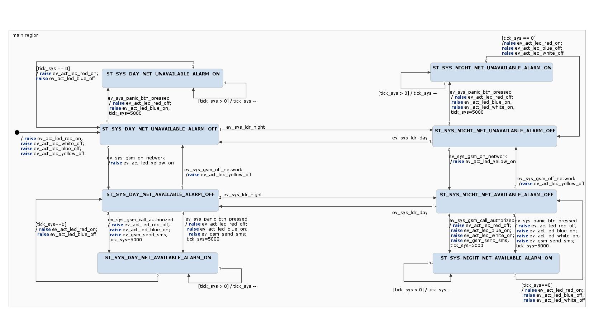
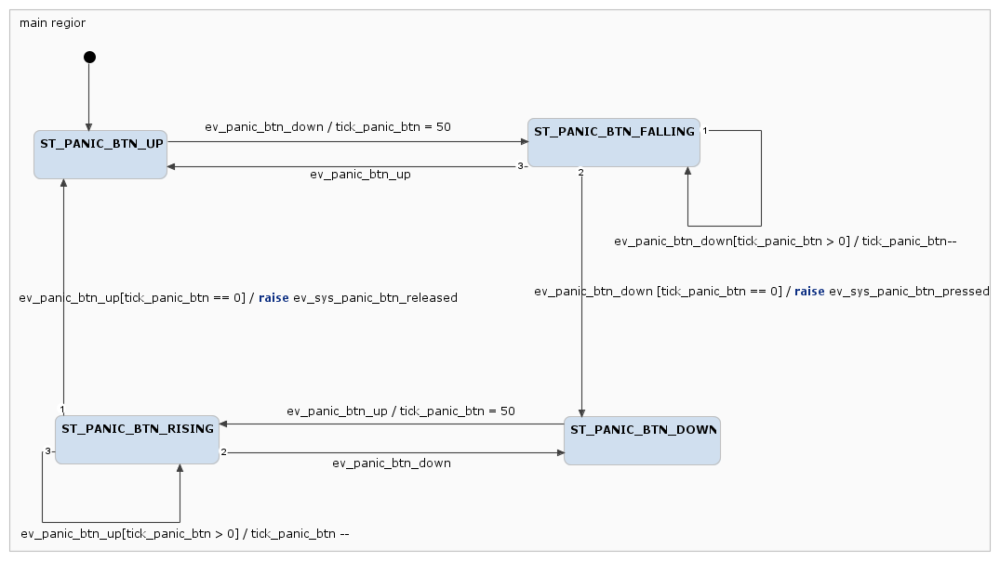
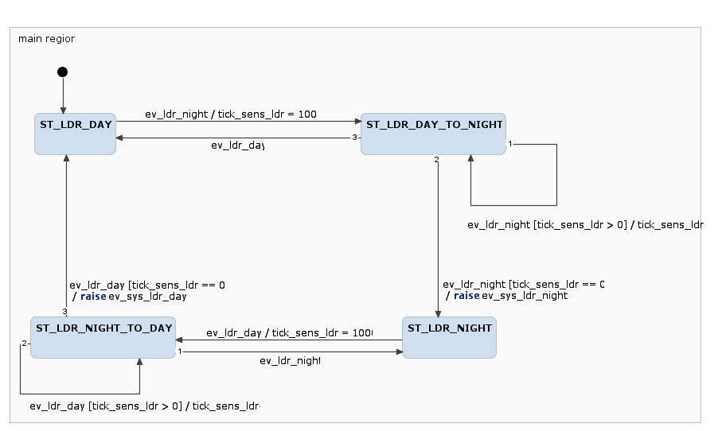
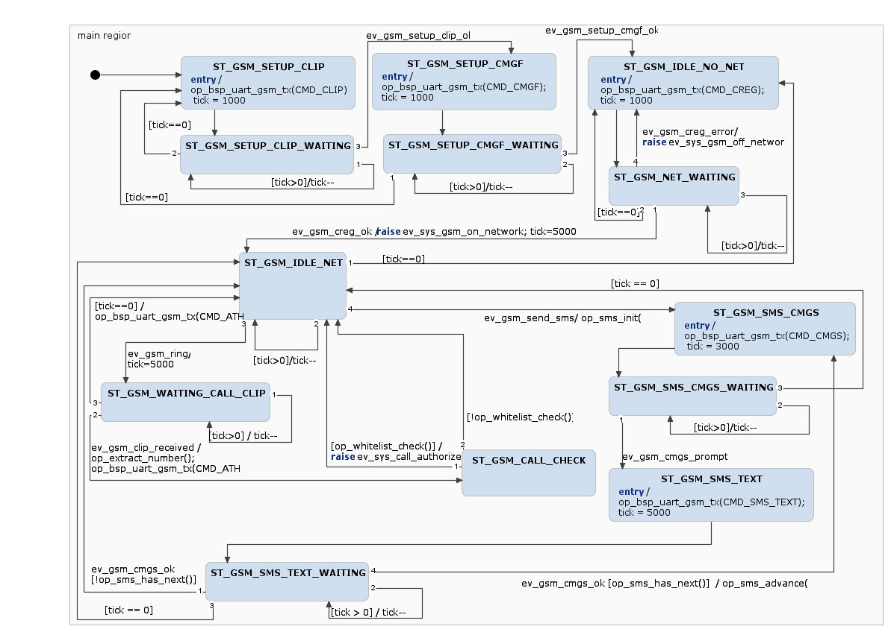
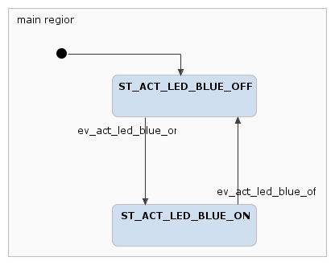
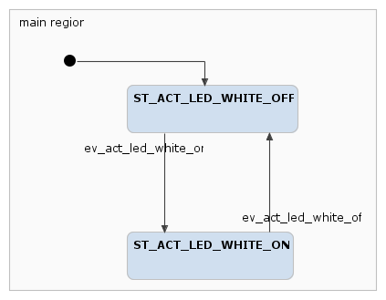
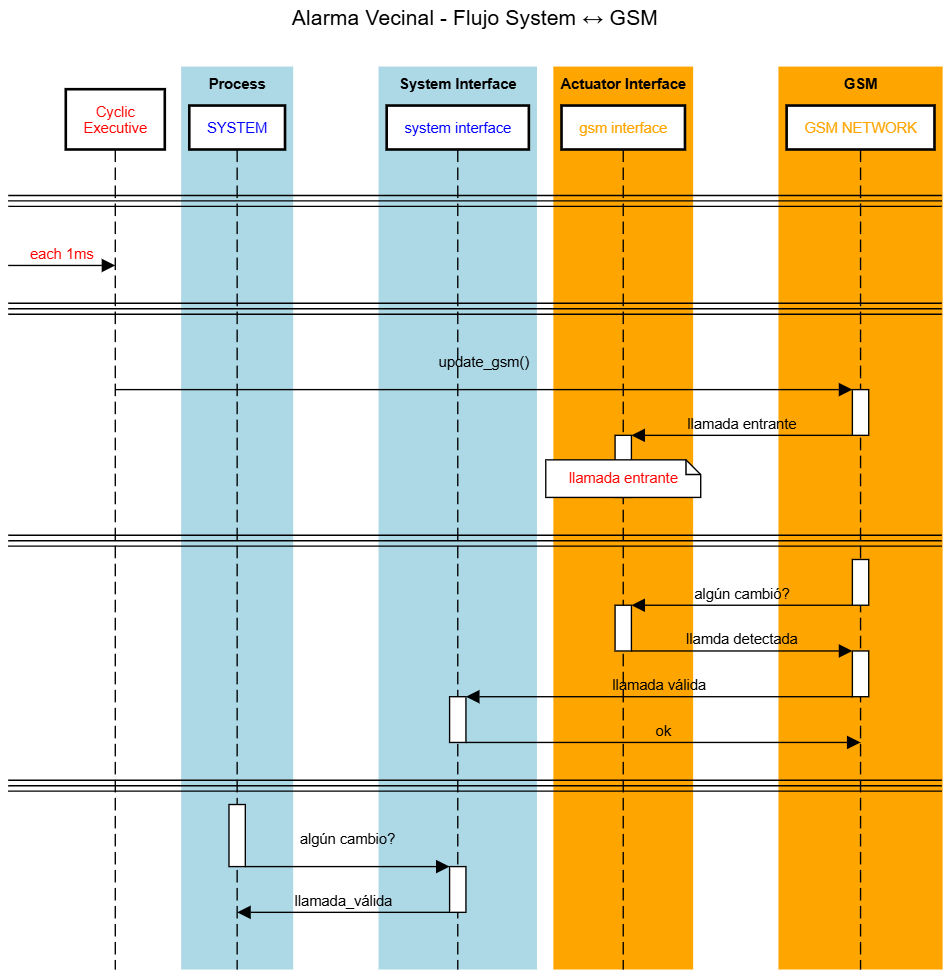

  

  <strong>UNIVERSIDAD DE BUENOS AIRES</strong>

  <strong>Facultad de Ingeniería</strong>

  <strong>86.65/TA134 Taller de Sistemas Embebidos</strong>

# Memoria del Trabajo Final: Alarma Vecinal 

<table align="center">
  <tr>
    <th>Autor</th>
    <th>Padrón</th>
  </tr>
  <tr>
    <td>Valentín Alexis Guirin</td>
    <td>107416</td>
  </tr>
  <tr>
    <td>Yerson Monzón Alayo</td>
    <td>104262</td>
  </tr>
  <tr>
    <td>Carolina Gonzales Peralta</td>
    <td>110804</td>
  </tr>
</table>

  <em>Este trabajo fue realizado en la Ciudad Autónoma de Buenos Aires, entre diciembre de 2025 y marzo de 2026.</em>

---

##  Índice General
1. [Resumen ](#resumen)
2. [Estado de Implementación](#estado-de-implementación)
3. [Arquitectura del Sistema](#arquitectura-del-sistema)
4. [Lógica de Control (FSM)](#lógica-de-control-fsm)

---

##  Resumen 
En el presente trabajo se diseñó e implementó una alarma vecinal para solucionar la problemática de inseguridad en barrios de la Ciudad de Buenos Aires. Mediante una llamada desde su teléfono movil, teléfono fijo, asi como presionando un botón de pánico, los usuarios pueden activar alertas sonoras y lumínicas. El sistema permite el mantenimiento vía BLE con doble factor de autenticación y gestión de whitelist, los cambios realizados se guardas  en una memoria EEPROM externa.

---

##  Estado de Implementación

| Funcionalidad / Módulo | Estado | Nota Técnica |
| :--- | :---: | :--- |
| **Núcleo Base (STM32F103)** | 🟢 | Periféricos y SysTick configurados. |
| **Módulo GSM (SIM800L)** | 🟢 | Llamadas y envío de SMS operativos. |
| **Gestión BLE (HM-10)** | 🟡 | En fase de diseño del diagrama de estados . |
| **Memoria EEPROM (I2C)** | 🟡 | Depende del módulo BLE. |
| **Sensor LDR** | 🟢 | Calibración de umbral nocturno lista. |
| **Botón de Pánico** | 🟢 | Interrupción externa configurada. |
| **Modo Bajo Consumo** | 🟢 |Hecho |

> **Leyenda:** 🟢 Completo | 🟡 En Desarrollo | 🔴 Pendiente

---

##  Lógica de Control (FSM)
Aquí se detallan las máquinas de estados finitos que gobiernan el comportamiento del sistema.

### 3.1 FSM del sitema (Sistema Global)
Gestiona el paso entre alarma activa, mandar alertas y administración de la whitlist.

  

### 3.2 FSM del botón de pánico
Lógica de antirebotes físicos del botón de activación de la alarma.

  

### 3.3 FSM del sensor LDR
Lógica de validación del estado de la luz ambiental para saber si la luz estroboscópica es necesaria ser activada.

  

### 3.4 FSM del dispositivo GSM (sim800l)
Controla la inicialización del módulo, el registro en la red y la gestión de llamadas entrantes.

  

### 3.5 FSM del dispositivo BLE
Gestiona usuarios que puede editar la whitlist.

  

### 3.6 FSM del LED azul
Caracteriza una sirena sonora, se activa ya sea de día o de noche

  

### 3.7 FSM del LED blanco
Caracteriza una luz estroboscópica, se activa solo de noche.

  

### 3.8 FSM del LED rojo
Es un LED que da información de que el la alarma está activada y puede ser accionada en cualquier momento.

  

### 3.9 FSM del LED amarillo
Es un led que se queda prendido siempre que el gsm esté conectado a la red y entonces puede recibir llamadas y mandar las alertas por mensaje de texto a la policía.

  

##  Diseño del Firmware
### 6.1 Diagramas de Secuencia
Los diagramas de secuencia ilustran la interacción temporal entre los módulos:

* **Interacción entre los sensores y el sistema:** 

  

* **Interacción desde el módulo GSM hacia el sistema:** 

  

* **Interacción desde el sistema hacia el módulo GSM:** 

  

